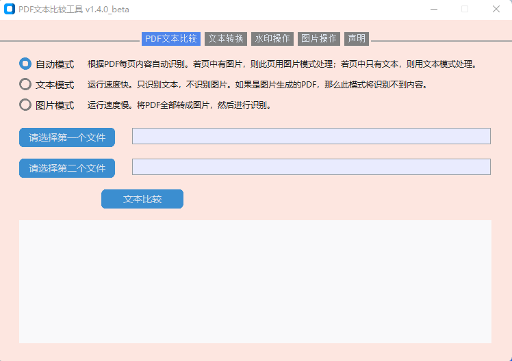
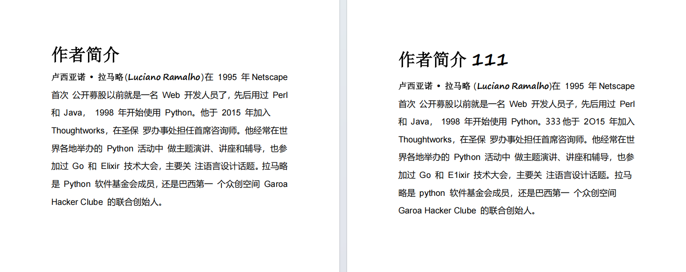
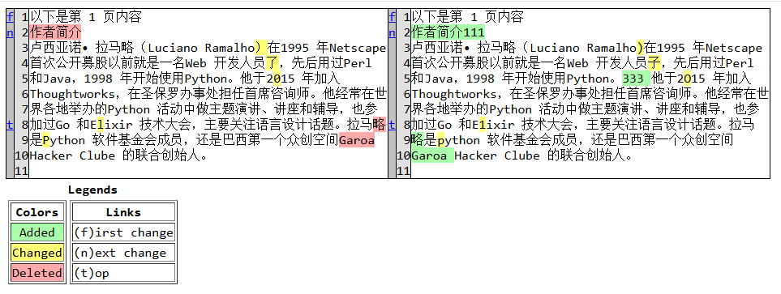

## 软件说明
用于pdf内容比较，比较结果不保证完全正确，仅供参考。

  
上图为代码UI截图。选择待比较的两个 PDF 文件，并实时显示比较进度与结果。

  
上图为测试文件截图。左侧为test_pdf1.pdf，右侧为test_pdf2.pdf。

  
上图为比较结果截图。比较完成后，会生成 comparison.html 结果比较文件。

**软件运行模式：自动模式、文本模式、图片模式。**  
文本模式：运行速度快。只识别文本，不识别图片。如果是图片生成的PDF，那么此模式将识别不到内容。  
图片模式：运行速度慢。将PDF全部转成图片，然后进行识别。  
自动模式：根据PDF每页内容自动识别。若页中有图片，则此页用图片模式处理；若页中只有文本，则用文本模式处理。  

**重点：**  
1 程序运行目录中不能有中文字符。  
2 此程序只在本机运行，不会向其他设备传递任何信息。  
3 此程序所生成的文件结果仅供参考。

## 环境说明
已在下面环境中进行验证。  
操作系统：win11  
Python：3.12

## 安装说明
**1、安装依赖**  
```py
git clone https://github.com/bibo19842003/compare_pdf
cd compare_pdf
pip install -r requirement_win11.txt
```


## 代码运行
```py
python main.py
```

## 打包EXE文件
目前，打包出的exe文件运行报错，待后续完善。

## 其他说明
**1、运行设备**  
代码使用CPU运行，非GPU运行；如果想使用GPU运行，请卸载 paddleocr 并安装 paddleocr-gpu。
**2、模型版本**  
OCR 模型版本为 PP-OCRv5，若使用 v4 版本，请将代码切换到分支 main_ocr_v4 。