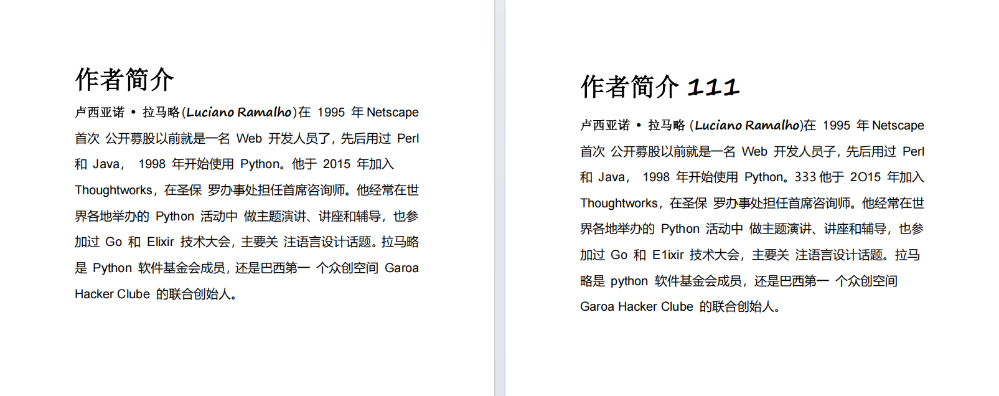
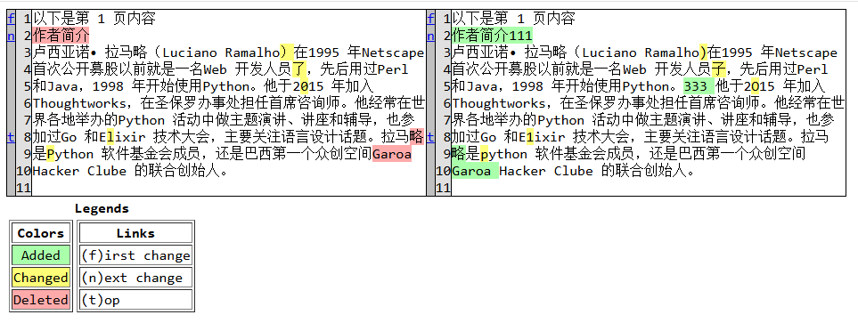

# 说明

## 软件说明

用于pdf内容比较，比较结果不保证完全正确，仅供参考。

  
上图为代码UI截图。选择待比较的两个 PDF 文件，并实时显示比较进度与结果。

  
上图为测试文件截图。左侧为test_pdf1.pdf，右侧为test_pdf2.pdf。

  
上图为比较结果截图。比较完成后，会生成 comparison.html 结果比较文件。

**软件运行模式：自动模式、文本模式、图片模式。**  
文本模式：运行速度快。只识别文本，不识别图片。如果是图片生成的PDF，那么此模式将识别不到内容。  
图片模式：运行速度慢。将PDF全部转成图片，然后进行识别。  
自动模式：根据PDF每页内容自动识别。若页中有图片，则此页用图片模式处理；若页中只有文本，则用文本模式处理。  

**重点：**  
1 程序运行目录中不能有中文字符。  
2 此程序只在本机运行，不会向其他设备传递任何信息。  
3 此程序所生成的文件结果仅供参考。
4 由于系统兼容性原因，ubuntu下只有 PDF 文档比较功能可以使用。

## 环境说明

已在下面环境中进行验证。  
操作系统：win11 / ubuntu22.04
Python：3.12

## 安装说明

### win11 安装说明

```py
git clone https://github.com/bibo19842003/compare_pdf
cd compare_pdf
pip install -r requirement_win11.txt
```

cpu 运行：

```py
pip uninstall paddlepaddle-gpu
python -m pip install paddlepaddle==3.3.0 -i https://www.paddlepaddle.org.cn/packages/stable/cpu/
pip install -U paddleocr
pip install paddlex[ocr]==3.4.1
```

gpu 运行：

```py
pip uninstall paddlepaddle
python -m pip install paddlepaddle-gpu==3.3.0 -i https://www.paddlepaddle.org.cn/packages/stable/cu126/
pip install -U paddleocr
pip install paddlex[ocr]==3.4.1
```

### ubuntu22.04 暂未验证

```py
git clone https://github.com/bibo19842003/compare_pdf
cd compare_pdf
pip install -r requirement_ubuntu22.04.txt
```

## 代码运行

```py
python main.py
```

## 打包EXE文件

目前，打包出的exe文件运行报错，待后续完善。
